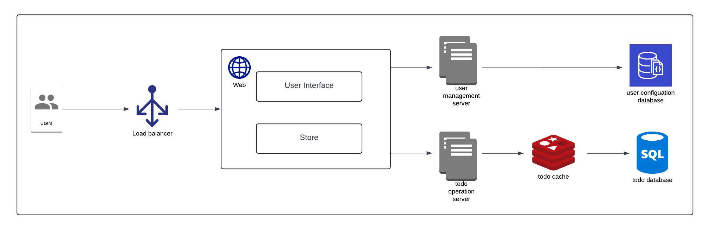
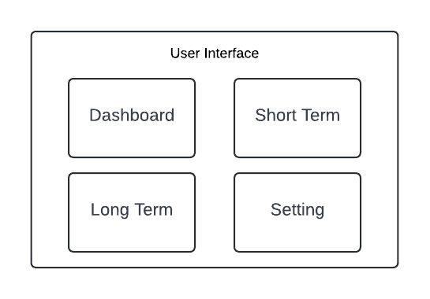

# Empire

An planner app to improve yourself

## Development

For setup instructions, please refer to the README files in the respective directories:

- [web/README.md](./web/README.md) for the frontend
- [backend/README.md](./backend/README.md) for the backend

**Note:** You need to set up both the frontend and backend, as some environment variables (such as `REACT_APP_API_URL` and `FRONTEND_URL`) are dependent on each other.

## High Level System Architecture

### Client

#### User Interface

### Server

## Data Model (DRAFT)

## Interface definition (APIs) (DRAFT)

## Others

### i18n

### Accessibility

### Security
